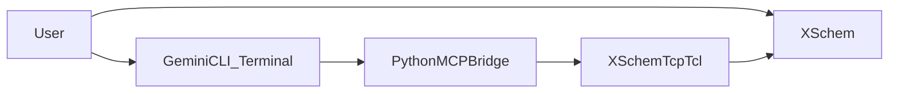

# Architecture

## Goals

- Keep XSchem as the source of truth for schematic semantics and simulation.
- Add MCP-compatible tooling without forcing a rewrite of XSchem internals.
- Allow Gemini CLI (running in terminal) to call XSchem tools directly.

## High-Level Topology

## Runtime Components

## XSchem process

- Existing Tcl/Tk + C event loop and command dispatch.
- New wrapper surface in `src/xschem.tcl`:
  - `mcp_get_context`
  - `mcp_list_symbols`
  - `mcp_place_symbol`
  - `mcp_create_symbol`
  - `mcp_set_instance_property`
  - `mcp_generate_netlist`
  - `mcp_run_simulation`
  - `mcp_read_simulation_results`
  - `mcp_annotate_operating_point`

## Python bridge

- `xschem_client.py`: TCP transport to XSchem remote Tcl socket.
- `tool_registry.py`: maps MCP tools to wrappers with argument coercion.
- `policy.py`: allowlist + validation + confirmation gate.
- `mcp_stdio_server.py`: MCP-style JSON-RPC server over stdio.

## Design Decisions

## Why wrapper-based hybrid integration?

- XSchem already has rich Tcl command surfaces and TCP transport.
- Wrappers add stable contracts and validation without broad C refactor.
- Bridge enforces policy and schema independently of XSchem internals.

## Why terminal-first Gemini integration?

- Directly uses Gemini CLI MCP support and avoids maintaining custom UI.
- Keeps workflow in the same terminal where Gemini is already running.
- Minimizes moving parts while preserving full tool functionality.

## Data Flow for a Typical Action

Example: `xschem.insert_symbol`

1. Gemini CLI sends `tools/call` with arguments.
2. Bridge validates tool name/args and confirmation requirement.
3. Bridge maps to `mcp_place_symbol`.
4. XSchem executes command and returns normalized JSON.
5. Bridge returns MCP `content[]` response back to Gemini CLI.

## Async Considerations

- Simulation in XSchem is process-based and may be asynchronous.
- Current bridge returns the simulation execution id; Gemini can request follow-up tools for result loading.

